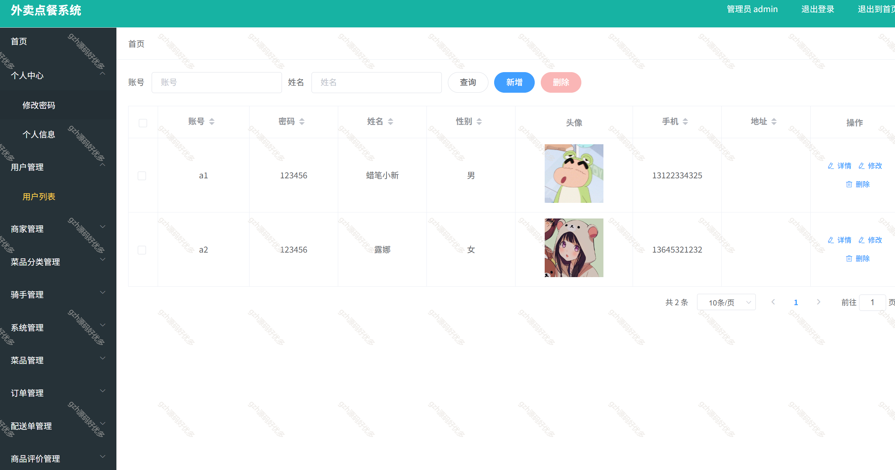
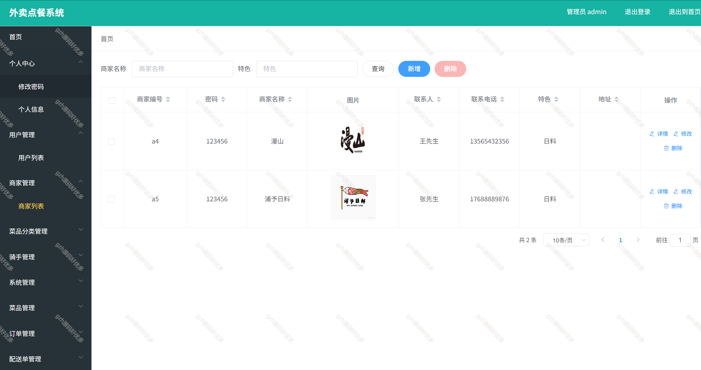
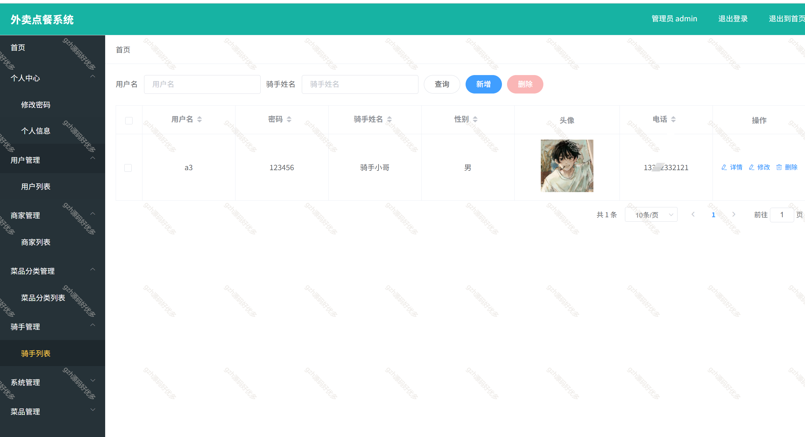
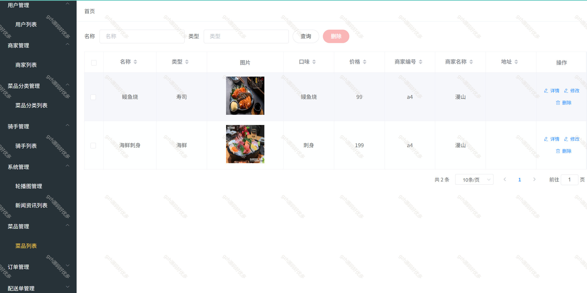
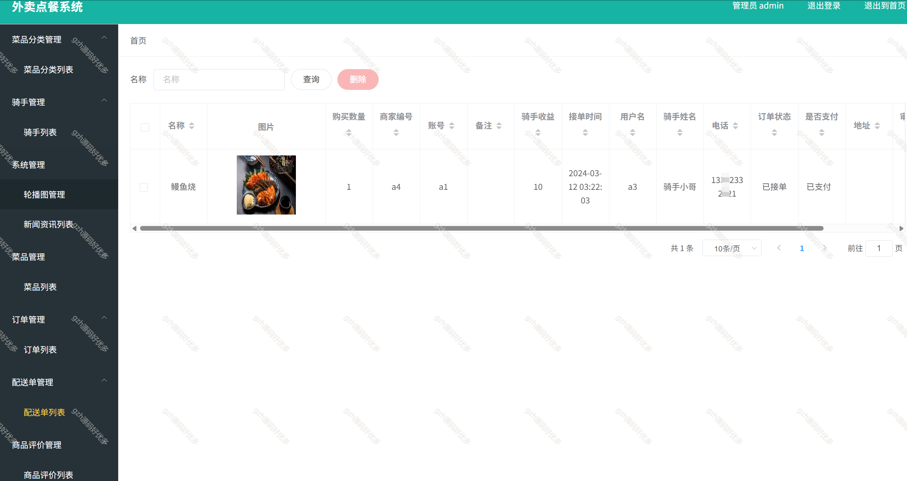
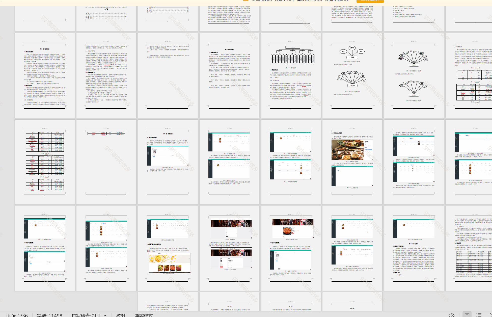

# springbootA520
springbootA520外卖点餐系统
 
## 查看主页获取源码

### 一、关键词

外卖系统，外卖点餐系统

 

### 二、作品包含

源码+数据库+设计文档+PPT+全套环境和工具资源+部署教程

 

### 三、项目技术

前端技术： vue2 ElementUI Axios Echarts Layui html
后端技术：Java、SpringBoot2.0、MyBatis

  

 

### 四、运行环境（以下版本亲测，其他版本未知，请自测）

开发工具：IDEA/eclipse  + VSCODE

数据库：MySQL8

数据库管理工具：Navicat10以上版本

环境配置软件： JDK17 + Maven3.6.3

前端Nodejs：14

浏览器：谷歌浏览器

 

### 五、项目介绍

项目编号：springbootA520

外卖点餐系统    软件是一款方便、快捷、实用的信息服务查询软件。随着智能网络在全球市场的不断普及以及各种智能平台的使用，作为中国主流智能的技术开发系统，自然需要这样的软件来满足更多用户的需求和体验

系统中的功能模块主要是实现管理员；首页、个人中心、用户管理、商家管理、菜品分类管理、骑手管理、系统管理、菜品管理、订单管理、配送单管理、商品评价管理，
商家；首页、个人中心、菜品管理、订单管理、配送单管理、商品评价管理、我的收藏管理，用户；首页、个人中心、订单管理、配送单管理、商品评价管理、我的收藏管理、
骑手；首页、个人中心、订单管理、配送单管理、商品评价管理等功能部分

 

### 六、运行截图

